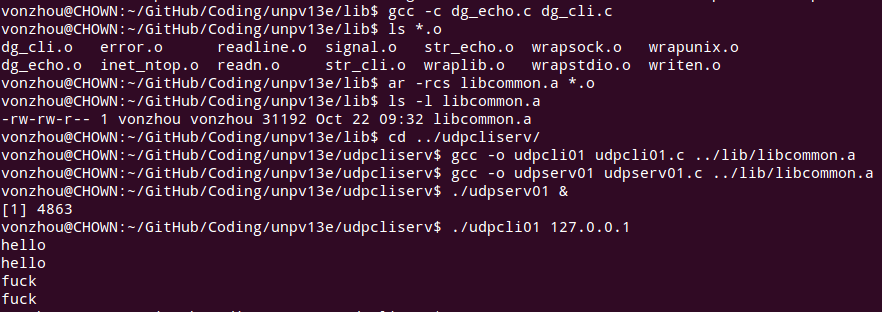
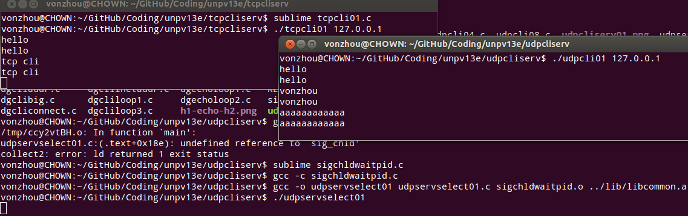

基本UDP套接字编程
---

### UDP 回射客户端服务端程序基本版本 [udpcli01.c](udpcli01.c) ， [udpserv01.c](udpserv01.c)

所需要的基本库函数都在lib目录下，所以先ar得到一个目标文件归档文件，然后具体链接使用

### 使用select()的TCP和UDP回射服务器程序

Idea：在一个server中启动多个监听端口时，就使用select

